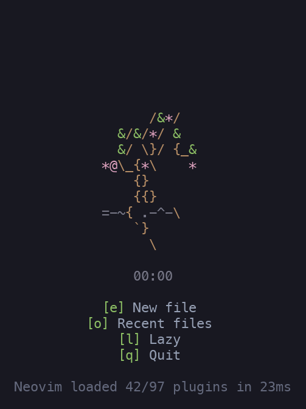

# bonsai.nvim
## Track your day, watch something live!

<p align="center">
    

It's 8:30 A.M. You're getting a head start on long day of writing TOML by hand.
You're greeted by a gentle sapling, just starting out it's life.

It's 11:45 A.M. No strings have been parsed correctly all in any bit of config
you've written. You're beginning to question what a string even is. But the
bonsai you see is strong. It's just begun to rise to meet the summer wind.

It's 7:52 P.M. Your phone has five missed calls from "Home" and your childrens
names are a blur. Was this YAML the whole time? What does QWEN think? Your
bonsai has begun to droop and drop it's leaves. Where did the time go?

It's 11:59 P.M. Chaos reigns. Single, double, even triple quotes dot the
pockmarked landscape of your buffers. Numbers are strings are blocks are files
are ... Your bonsai is dead. Just wood where life was. A cold draft sweeps
through and seems to turn the hands of the clock itself. 

12:00 A.M. A new day is here. You blink, rub, shake your head. The scales have fallen
from your eyes. The file parses clean, it was JSON all along! Ship it! Go Home!
Swim through the still blue midnight air to the warm embrace of _home_,
meatloaf still there in the microwave, _waiting_. Your bonsai is reborn. Just a
sprig now, but ready to grow strong while you sleep.


## Usage

```lua
-- lazy.nvim
{ dir = "~/dev/bonsai.nvim", name = "bonsai.nvim", lazy = true }
```

```lua
local header = require("bonsai").pick({
	hour = tonumber(vim.fn.strftime("%H")), -- default: current hour
	set = "bonsai_boxed", -- default: the setup() set, "bonsai" out of the box
	default = some_fallback_ascii, -- returned for a bad hour or unknown set
})
```

`pick` returns the stage for the hour as a multiline string. The 24 hours
are split evenly across the stages of the set, so a set can have any
number of stages.

## Art sets

Set a default set once:

```lua
require("bonsai").setup({ set = "bonsai_boxed" })
```

Supply your own set with `register`. Stages are ordered youngest to
oldest:

```lua
require("bonsai").register("cactus", {
	stages = { seed_art, sprout_art, full_art },
})

local header = require("bonsai").pick({ set = "cactus" })
```

`pick` also accepts a set table directly: `pick({ set = { stages = {...} } })`.
The raw art is available in the `require("bonsai").sets` registry, e.g.
`sets.bonsai.stages`.
